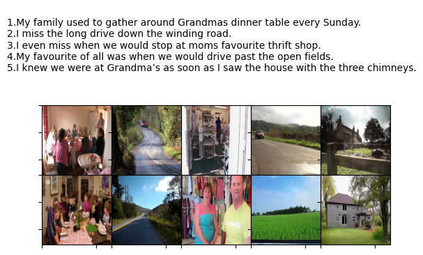

# Synthesizing Coherent Story with Auto-Regressive Latent Diffusion Models Trained on SSID




This is a reimplementation of ARLDM https://github.com/xichenpan/ARLDM on a new dataset SSID https://ieee-dataport.org/documents/sequential-storytelling-image-dataset-ssid

We aim to 
- **Prove that the ARLDM model is capable
of generalisation**. Since these models have been trained
on just 1 real world dataset namely VIST ,it does not guar-
antee that models generalisation capability to any real
world dataset.
- **More coherent Dataset should result in better results.**
Commpared to VIST being a collection of random Flickr
images made into coherent stories, SSID has been made
from real movie and youtube clips hence actually being
part of a story

## Environment
```shell
conda create -n arldm python=3.8
conda activate arldm
conda install pytorch torchvision torchaudio cudatoolkit=10.2 -c pytorch-lts
git clone https://github.com/Flash-321/ARLDM.git
cd ARLDM
pip install -r requirements.txt
```
## Data Preparation
We need IEEEDataport Access for downloading SSID Dataset. To make the hdf5 file we have written a python file on the line so f authors python file to create hdf5 file for other dataset. It is located in 
```data_script/ssid_hdf5.py```
In the config.yaml for dataset access and reading 
```dataset/vistsis.py``` has been modified.

* To accelerate I/O, using the following scrips to convert your downloaded data to HDF5
```shell
python data_script/ssid_hdf5.py
--data_dir /path/to/ssid_data
--save_path /path/to/save_hdf5_file
 ```

## Training
Specify your directory and device configuration in `config.yaml` and run
```shell
python main.py
```
## Sample
Specify your directory and device configuration in `config.yaml` and run
```shell
python main.py
```

## Acknowledgment and Conclusion
Thank you to the authors of ARLDM for making their implementation public. With our work we show that ARLDM is genralisable on new SSID dataset which is real world dataset generated from youtube clips. We also report that  we obtained an FID of 52 for Story Visualisation mode with just 5 epochs of training on SSID dataset with frozen BLIP and CLIP layers. With higher training and unfrozen layer we could obtain better results.

## Citation
If you find this code useful for your research, please cite our paper:
```bibtex
@article{pan2022synthesizing,
  title={Synthesizing Coherent Story with Auto-Regressive Latent Diffusion Models},
  author={Pan, Xichen and Qin, Pengda and Li, Yuhong and Xue, Hui and Chen, Wenhu},
  journal={arXiv preprint arXiv:2211.10950},
  year={2022}
}
```
